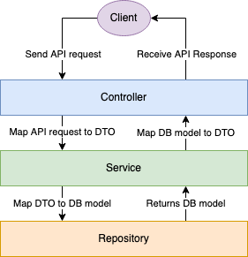

# Library

## Dev environment setup

0. Install [JDK 11](https://adoptopenjdk.net/) and [Docker](https://www.docker.com/products/docker-desktop)
1. `cd tools` 
2. `./start-local-env.sh` to bring up all needed services
3. Run the application via the `Run (dev)` IntelliJ Run Configuration or with `./mvnw spring-boot:run -Dspring.profiles.active=dev`

## Generating Fake Data And Seeding

In a _real_ project you probably wouldn't generate fake data for each developer, 
you'd probably have a separate repo with seed data for local dev envs.

1. Run the `Generate Fake Data` IntelliJ Run Configuration or `./mvnw springboot:run generateFakeData --numBooks=10000 --outputFile=fakeData.10k.sql`
2. Run the `Seed DB` IntelliJ Run Configuration or `./mvnw springboot:run seedDb --inputFile=fakeData.10k.sql`
2. Run the `Seed Search` IntelliJ Run Configuration or `./mvnw springboot:run seedSearch`

## Architecture

### Application architecture

This app is a classic 3-tier architecture:

## FAQs

### Why No @OneToOne/@ManyToOne

We've found (over time) these annotations cause some headaches, so we rarely use these anymore.

- cascading updates
  - accidentally modify a child
- N+1 queries
  - oh shoot, we rarely need that field, better add `FetchType.LAZY`!
- naive toString() problems
  - A contains B and B contains A, toString() causes a `StackOverflowException`
  
### Common (sub)package names

#### model

Represents API (REST) models. 
These are what Controllers receive as input and produce as output. 
These can be generated with [Immutables](https://immutables.github.io/) since it has [Jackson](https://github.com/FasterXML/jackson) support.

#### dto

Represents DTOs. 
These should be used in the Service layer of the application. 
Feel free to add these to interfaces to cross-package communication. 
Usually generated via [Immutables](https://immutables.github.io/) unless there's a good reason not to.

#### mapper

Represents Mappers (classes that convert from one type to another).

#### exception

Represents `Exception`s that can be thrown by this package. 
It's usually a good idea to extend `ErrorCodeException` and provide package-specific `ErrorCode`s.

#### db

Represents DB models. These are POJO's (Plain Old Java Objects) with some annotations (`@Column`, `@Entity`) to assist with JPA mapping these objects.
_Not_ generated by [Immutables](https://immutables.github.io/) since JPA objects have some pitfalls when generated or proxied.

##### equals and hashCode

Usually it's sufficient to just check the `@Id` of the class (typically a `UUID`) in these methods.

##### toString

Try not to expand relations in toString (ie: `A.toString()` prints `B` and/or `B.toString()` prints `A`). 
This makes debugging slow (and in this case would throw a `StackOverflowException`). 
Printing the ID of the relation is much faster if you need this data in the String. 

### Package Descriptions

(omitting the name.marcocirillo.library prefix)

#### account

Represents an Account. We didn't call them `User`s since `user` is a reserved word in Postgres and having to keep tracks of escapes and casing is a nightmare.

#### auth

Handles authentication. Auth providers must implement AuthService to provide auth to the platform. `SomeAuth` is the dummy auth provider we used in this example.

#### author

Represents an Author of a Book.

#### base

Base classes used by other packages go here.

#### book

Represents a Book. 

#### book.category

Represents a Category assigned to a Book. Multiple Categories can be assigned to a Book.

#### book.favourite

Powers Favourite Books, an email Notification that sends all members their favourite books.

#### category

Represents Categories

#### checkout

Handles checking out Books. package `checkout.validator` contains validators for Checkouts, to ease in testing and to keep `CheckoutService` smaller.

#### checkout.overdue

Powers Overdue Books, an email Notification sent to Accounts when books are overdue.

#### command

Powers CLI commands for the app (ie: `./mvnw springboot:run seedDb` would have a corresponding `SeedDbCommand` class).

#### config

Global app configuration. If a config isn't global (`CronConfig` is an example), it can be localized to its own package (`CronConfig` is only for cron jobs, so it's in the `cron` package).

#### cron

Powers cron jobs for the app.

#### fakedata

Generates dummy data for the app. In a _real_ project, this would likely be in its own repository.

#### filter

Spring `Filter`s (middlewares) that run before hitting `Controller`s.

#### inventory

Represents Inventory (number of Books in stock that can be checked out).

#### notification

Handles sending notifications.

#### search

Handles search.

#### seed

Handles seeding (filling in data to) the DB and search indices.

#### util

Small utilities used by other packages.

#### web

Handles Spring web configuration, including security (in the `web.security` package).

## TODO

- [ ] swagger
- [ ] refactor books to be individual items